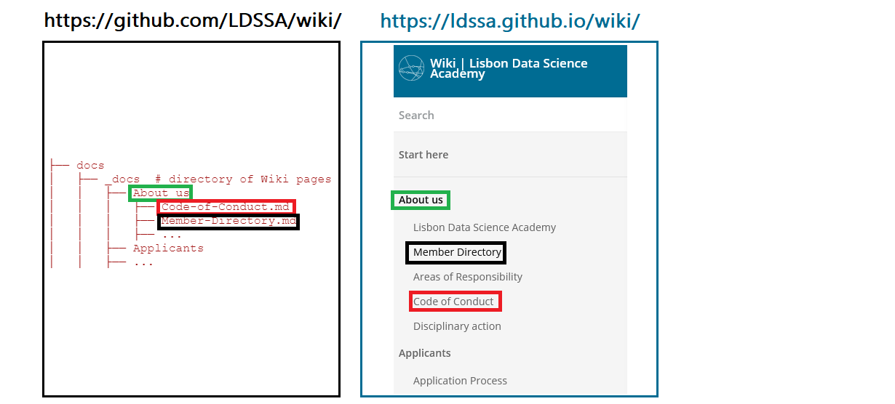

# LDSA Wiki

This Wiki is hosted on https://ldssa.github.io/wiki/. The Wiki pages are stored inside `/docs/_docs` folders as markdown files.



<br>

## How to edit an existing page

1. Locate the file (page) you want to edit inside the `docs/_docs/` subfolders and click on it;
1. Click the edit button (pencil symbol) on the top-right corner to edit the page;
1. When you're ready, insert a commit message at the end of the page and select the option `Create a new branch`. Click `Propose changes`;
1. The Documentation Team will review and approve your changes.

**Note**: Please store any images in `/docs/_docs/images`.

**Alternatively**, you can clone this repo, do your changes locally, commit and PR.

## How to create a new page

1. Navigate to the folder (menu category) where you want to store your page, inside `docs/_docs/`;
1. Click the button "Add file" on the top-right corner to start editing the new page;
1. Insert the header first. This is where you specify to what sidebar category the page belongs to, its title and the order in which it appears on that sidebar category.

    **Example:**
    ```markdown
    ---
    title: Application Process
    category: Applicants
    order: 1
    ---
    ```

1. When you're ready, insert a commit message at the end of the page and select the option `Create a new branch`. Click `Propose changes`;
1. The Documentation Team will review and approve your changes.

**Note**: Please store any images in `/docs/_docs/images`.

**Alternatively**, you can clone this repo, do your changes locally, commit and PR.


## Develop

This section describes the necessary packages to be installed if you want to copy and run the website on your local machine.

### **1. Install necessary packages**

1. Update and install all prerequisites:

    ```bash
    sudo apt-get update
    sudo apt-get install ruby-full build-essential zlib1g-dev
    ```

1. Add the environment variables to `~/.bashrc` by running:

    ```bash
    echo '# Install Ruby Gems to ~/gems' >> ~/.bashrc
    echo 'export GEM_HOME="$HOME/gems"' >> ~/.bashrc
    echo 'export PATH="$HOME/gems/bin:$PATH"' >> ~/.bashrc
    source ~/.bashrc
    ```

1. Install `jekyll` and `bundler`

    ```bash
    sudo gem install jekyll
    sudo gem install bundler -v '< 2.0'
    ```

That's it!

### **2. Run the site locally**

```bash
bundle install
```

```bash
bundle exec jekyll serve
```

## References

- [Template source](https://github.com/CloudCannon/edition-jekyll-template)

- [Installing Jekyll on Ubuntu](https://jekyllrb.com/docs/installation/ubuntu/)