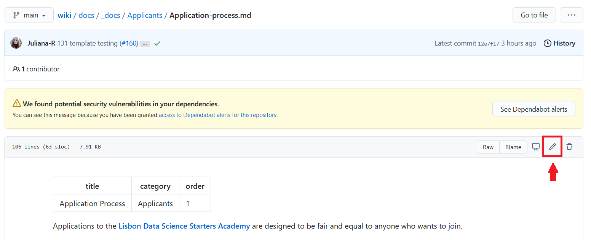

The Wiki is hosted on github.ldssa

## How to create/edit a page

Each page is stored as a markdown in a folder inside `/docs/_docs/`. For example, the page `Application Process` will be located in `https://ldssa.github.io/wiki/`**`Applicants`**`/Application-process/`, and stored in folder `/docs/_docs/`**`Applicants`**. All pages follow this logic.

### Edit an existing page

If you want to edit an existing page, browse it in the pages directory [`/docs/_docs/`](https://github.com/LDSSA/wiki/tree/main/docs/_docs).

1. Click on the page (`.md` file) you want to edit;
1. Click the edit button

1. When you'r ready, insert a commit message at the end of the page, select the option `Create a new branch ...` and click `Propose changes`.

1. Someone from the Documentation AOR will review and approve your changes

You can edit the page locally by cloning the repo, editing, commiting and do a Pull Request to `main`.

---

Alternatively, you can clone this repo, do your changes locally, commit and PR.


## How to test the site locally (Ubuntu)

### **1. Install necessary packages**

1. Update and install all prerequisites:

    ```bash
    sudo apt-get update
    sudo apt-get install ruby-full build-essential zlib1g-dev
    ```

1. Add the environment variables to `~/.bashrc` by running:

    ```bash
    echo '# Install Ruby Gems to ~/gems' >> ~/.bashrc
    echo 'export GEM_HOME="$HOME/gems"' >> ~/.bashrc
    echo 'export PATH="$HOME/gems/bin:$PATH"' >> ~/.bashrc
    source ~/.bashrc
    ```

1. Install `jekyll` and `bundler`

    ```bash
    sudo gem install jekyll
    sudo gem install bundler -v '< 2.0'
    ```

**That's it!**

### **2. Run the site locally**

```bash
bundle install
```

```bash
bundle exec jekyll serve
```

## References

- [Template source](https://github.com/CloudCannon/edition-jekyll-template)

- [Installing Jekyll on Ubuntu](https://jekyllrb.com/docs/installation/ubuntu/)