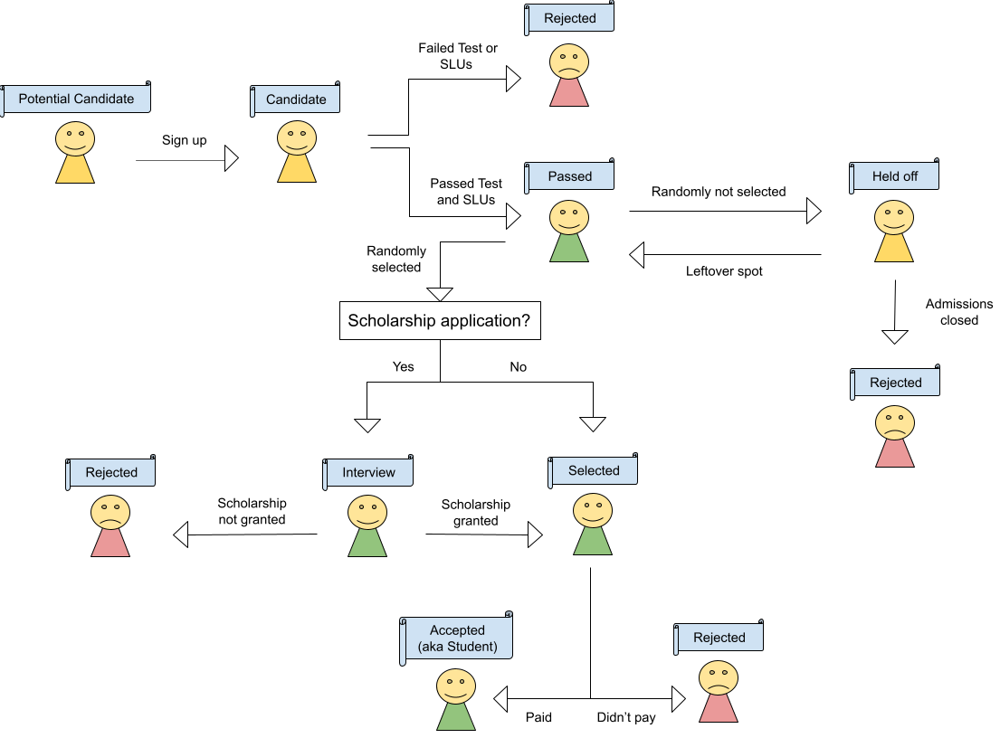

Admissions to the [**Lisbon Data Science Starters Academy**](../../Starters Academy (LDSSA)/01-Starters-Academy-(Course))
are designed to be fair and equal to anyone who wants to join.

Are you looking for admissions for the [**Data Science Prep Course?**](../../DS Prep Course/Data-Science-Prep-Course)

Candidates are required to show that they have sufficient skills to participate. During the admission process,
they'll have to complete a **coding test** that covers the Academy's
[pre-requisites](../../Starters Academy (LDSSA)/02-Target-audience-and-Pre-requisites-for-the-Starters-Academy), and
**3 Learning Units** about [Pandas](https://en.wikipedia.org/wiki/Pandas_(software)) where we'll teach new concepts and
evaluate them. Candidates need to pass both the coding test and the 3 SLUs.

These tests aim to assert that students will be able to take full advantage of the Academy, without being stuck
in technical implementation problems. It is a test for _sufficiency_, meaning we're not aiming to take "the best",
just to confirm that the students' skills are sufficient.

In case we have more candidates passing the tests than the 50 available seats in the Academy, candidates will
be selected at random, respecting all the [entrance restrictions](#entrance-type-restrictions) that we have in
place.

Admissions will be managed through our Portal (the link will be shared here soon).

All the classes, materials, student presentations and communication between students and instructors will be done in **English**. We don't explicitly test your English knowledge, but if you're not able to communicate well in English (both speaking and in writing), we may reject your application, as that would prevent you from taking advantage of the Starters Academy.

## Entrance type restrictions

In order to be consistent with our values of diversity, inclusion, and openness, we setup the following rules:
* Maximum of 10 company seats are allowed, with no more than 3 being allowed to come from any particular company
* We want to have at least 35% of female students, so we have a quota mechanism in place to achieve this.
You can read more about it [here](https://github.com/LDSSA/forum/issues/1).

## Time commitment and behaviour expectations

All the candidates of the Starters Academy are expected to read, acknowledge and follow:

* Our [**Code of Conduct**](https://ldssa.github.io/wiki/About%20us/Code-of-Conduct/);
* Our [**Refund Policy**](https://ldssa.github.io/wiki/Starters%20Academy%20(LDSSA)/07-Refund-Policy/)
* The time commitment described below

This is one of the first steps in the admissions process.

In terms of time commitment, the weekly workload of the Academy is about 10h/week. In particular, the specialization 1 and the capstone project are expected to be the more demanding periods, where the workload is expected to be much higher than the 10h/week average! The exact workload will vary from person to person.
If you're not able to put in this much time for the majority of the duration of the Academy,
you should think twice before applying: if you join the Academy and drop before the end,
you'll be wasting a seat that could be better used by someone else!

This year, the Academy will be remote, which means that you can participate from anywhere in the world.
However, students are required to be online during all the events (bootcamp and hackathons),
and these events will take place in Lisbon/London Time. So, if you're joining us from a country with
a very different timezone, make sure that you're really available considering the timezone differences.

We assume integrity in all of our students so we won't expend any resources attempting to disrupt or detect cheating. Instead, you should only start the admissions process, if you agree with the following:

- I am willing to dedicate a minimum of 5 hours per week to the academy.
- I understand that to get the most out of the experience, I should spend  an average of 10 hours per week on
the Academy, and likely more during specialization 1 and the capstone project.
- I understand that I have to be online during the Academy events, even if, because of timezone differences,
this means being online at 4am in the morning.
- I acknowledge that by cheating or being dishonest on the admission tests, or at any time during the course,
I am only harming myself and those around me by placing myself in a situation in which I will not have a path
to success.
- I acknowledge that if I am caught cheating or it becomes apparent that I cheated on the admission tests,
or at any time during the course, I will be expelled from the Academy.

## Application steps and important dates

| Activity                          | Date/Deadline                                    |
|-----------------------------------|--------------------------------------------------|
| Sign-up in the Admission Portal   | 09 Oct 2023 00h00 UTC+1 to 22 Oct 2023 23h59 UTC+1 |
| Scholarship applications          | 09 Oct 2023 00h00 UTC+1 to 22 Oct 2023 23h59 UTC+1 |
| Test & SLUs                       | 23 Oct 2023 00h00 UTC+1 to 05 Nov 2023 23h59 UTC |
| Candidate Selection               | 06 Nov 2023                                       |
| Payments & scholarship interviews | 07 Nov 2023 00h00 UTC to 11 Nov 2023 23h59 UTC|
| Admissions closed                 | 12 Nov 2023 23h59 UTC                           |

If you complete the signup in the portal and confirm your email address, you will always receive an email with the outcome of your application. This email should be sent between 6 and 12 November 2023.

### Admission tests

You have 3 hours to complete the coding test. You can start the test at any time between 23-10-2023 and
05-11-2023, but once you start, you have to complete it within 3 hours. It is NOT possible to pause the test and finish it later. So
make sure that you block 3 hours of your time to work on the test.

The Learning Units about pandas have two parts: the learning part and the exercises. In the learning part, you will learn
new concepts. In the exercises, we will evaluate if you understood these new concepts. Only the exercises need to
be submitted and will be graded. You can complete the Learning units at any
time between 23-10-2023 and 05-11-2023 and you can make pauses while working on them.

The dates of the submission of the coding test and of the Learning Units don't have any influence on the selection
process, as long as it's before 05-11-2023 23h59 UTC. Finishing earlier doesn't give you any advantage.

These are the main topics that will be evaluated in the coding test:
- Programming in Python
- Numpy
- Basics of working with the command line terminal
- Git

You can see them in more detail [here](https://docs.google.com/spreadsheets/d/1JzRfuacM5Q_XsnSMgEqOZH_cCBnT0J6K-e-687fFa6s/edit#gid=2018895387).

This is the content that will be taught and evaluated in the Learning Units:
- [Pandas 101](https://github.com/LDSSA/curriculum-development/blob/master/curriculum/01-bootcamp-and-binary-classification.md#slu01)
- [Subsetting Data in Pandas](https://github.com/LDSSA/curriculum-development/blob/master/curriculum/01-bootcamp-and-binary-classification.md#slu02)
- [Visualization with Pandas & Matplotlib](https://github.com/LDSSA/curriculum-development/blob/master/curriculum/01-bootcamp-and-binary-classification.md#slu03)

### Candidates selection

After the admission test period, we will select the Academy students by taking a random sample over all the candidates
who passed the tests. We'll make sure that the [entrance restrictions](#entrance-type-restrictions) are respected.

The candidates who are selected will confirm their application by paying the admission fee. If this fee is
not paid on time, we'll reject the candidate and give their seat to the next candidate in line.

### Fees

For the 2023/2024 Starters Academy, the fees will be:

- Student: 100€ (You'll need to present a valid student card at payment time)
- Regular: 500€
- Company: 1500€

Note: An invoice with a company VAT number (NIF in Portugal) will only be issued with a Company ticket. Student and Regular invoices can only have personal VAT numbers.

## Scholarships

Other than the **50 seats** that we usually have in the Academy, we'll have another **10 seats available
for scholarships**, meant for people who are unemployed or living with a low or no income.
The scholarships will have a 20€ fee instead of our regular pricing.

The process will be exactly the same as the one described above, except that:

- At the beginning of the admissions process, we'll ask if you need a scholarship. If you do, you'll
start your application in the scholarship mode, and **you won't be able to change this afterwards**.
- During the payment period, we'll schedule a video call with you to learn more about you and why you
need the scholarship. In this call, you should bring us proof that you're unemployed or have low income.
After the call, and in case the scholarship is granted, you'll have to pay the 20€ fee and the application
will be approved.

If we don't fill up all the scholarship seats, we'll select non-scholarship candidates in order to have
60 students in this batch of the Starters Academy.

## Summary

This scheme illustrates the admissions process.

***

_This is the admission process that will be followed in order to select the students for batch 7 of the Lisbon
Data Science Starters Academy._

_However, we reserve the right to make changes to this process in case of unforeseen events that harm our
Academy’s diversity._
