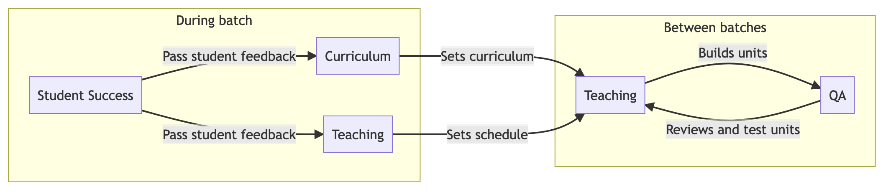
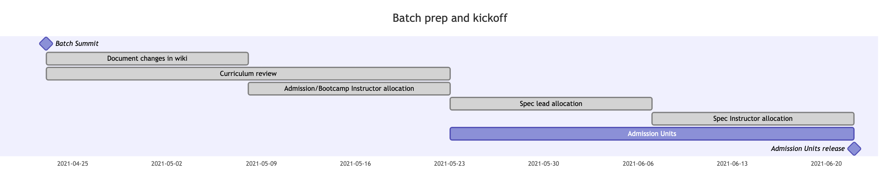
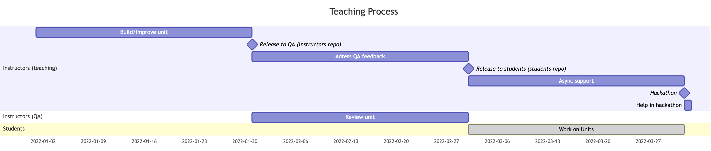

Contents:
- [Material structure](#materials)
- [Areas of responsibility](#aors)
- [Continuous improvement](#continuous-improvement)
- [Timeline](#timeline)
- [Key takeaways](#takeaways)

---

This page provides and overview of our teaching process and methodology. It is aimed at all volunteers
that are involved or are thinking of getting involved in the process of building and maintaining our materials. 
We start by describing lightly the structure and format of our materials; then we 
describe how the different areas of responsibility interact, and which roles they play in 
this process; finally, we provide an example timeline for the process.

# Academy materials

The product of our teaching process are the materials we hand out to the students.
We follow the following format for those materials:

* Jupyter notebooks: almost all content is delivered through jupyter notebooks. 
This provides an interactive way of learning, as students can run code while reading
through the explanations. 
* Nbgrader: In the context of jupyter notebooks, we also perform evaluation through
graded notebooks. For this purpose we use `nbgrader` (an overview of how to use it
can be found in [Using nbgrader](./03-Using-nbgrader-for-Exercise-Notebooks.md).)

All materials are planned, built and reviewed through github. In particular all repositories
are found under the [Academy GitHub](https://github.com/LDSSA/). These are the main
repositories to check and use:
* [curriculum-development](https://github.com/LDSSA/curriculum-development) (public): Our curriculum is reviewed and updated in this repository 
* [batchX-instructors](https://github.com/LDSSA/batch6-instructors) (private): To prepare the materials beforehand, instructors work in this
private repository. It's in this repo that all review and discussion around specific materials 
happens - for this purpose all feedback and suggestions should be posted as issues 
* [batchX-students](https://github.com/LDSSA/batch5-students) (public):  Close to the deadline of the unit, we trigger a process that releases the content of 
 the instructors repository into this public repository; this is the repository students will access

Following the patterns above you can check any previous edition's or the current batch materials.

# Areas of responsibility
 
You can help improve the units by joining one of several areas of responsibility. Below 
there is an overview of how they interact and what are the key responsibilities you
can have within each

### Curriculum

Overall responsibilities:
* Define which contents should be offered

### Teaching

Overall responsibilities:

* Produce and improve materials
* Release content and provide extra explanations and async support during the specialization
* Support teams during hackathons (if the unit is in the context of a specialization)

There are a few different roles worth mentioning:

| Role | Description |
|------|-------------|
| Admission/Bootcamp instructor | Build/improves units and delivers presentation on bootcamp weekend (admissions units are excluded from this)|
| Specialization instructor | Build/improves specialization units/hackathon and provides support during the hackathon day |
| Specialization lead | Coordinates specialization and potentially participates in minor tasks, if necessary |
| Specialization mentor | Typically a senior, provides support to other instructors developping the specialization |

### QA

Overall responsibilities:
* Review and test materials
* Deliver early feedback for instructors

### Student Success

Overall responsibilities:
* Keep track of students progress 
* Collect and deliver student feedback

# Timeline

Since batch6 that we are aligning the academy with the student's school year. As such
the timelines represented here follow that logic and provide rough estimates of the months
where each part of the process happens. This should serve as a base for volunteers to
know when to get involved in different parts of the process.

## Batch kick-start

In between batches we take student feedback and together with the rest of the 
organization debate potential changes to the structure and contents of the academy.
There are two main focus:

- The taught contents are revised and potentially updated - the final responsibility lies
on the curriculum AOR
- The schedule and structure of teaching are discussed and adjusted with student feedback -
the main responsibility lies on teaching AOR

After changes are discussed and closed, which typically happens during or around a 
general summit - prepared through github issues and shared in slack, the process follows 
with documenting and allocating volunteers for the next batch:

It's at this point that volunteers should be proactive and share where they would like
to work. All allocation is done through our [github's main repo](https://github.com/LDSSA/wiki/)
and is the responsibility of the teaching lead and the specialization leads (within a specialization)
to coordinate.

## Leaning units development

Most of the time, the curriculum won't change drastically in between batches. Actually,
in the majority of cases there are only slight adjustments or no adjustments at all regarding
the desired contents of the units. 

With this in mind, our process is designed to build
on top of the previous batch and improve the materials further. This allows us to take 
units that are already high quality and push them even further.

In general, the focus when improving an existing unit should be:
* Review the existing materials: go through the learning and example notebooks 
and check for potential improvements - maybe something isn't fully clear or would 
benefit from an extra example; this will also give you a chance of getting familiar
with the unit
* Revamp the exercise notebook: change the exercises within reasonable so they are 
not the same as the previous batches: it is up to you if you want to design a completely
new notebook, including the dataset and narrative, or if you want to work with the unit
already has set up.

This process can happen anytime from the moment the allocation is set until the unit is 
released but in its limit:
* the instructor should start working at least two months before the unit is released
* the instructor should deliver the unit to QA at least a month before the unit is to be released to students
* QA should deliver feedback as fast as possible, but all feedback should be delivered at least a week before 
unit is to be released to students
* the instructor should be available to support students via slack asynchronously during the
time of the specialization
* the instructor should be available to support the hackathon day for the specializationn

An example timeline can be seen below:

# Key takeaways 

* Everything is shared through github! 
* There are 2 repositories with the materials: one for the instructors to develop
and improve them; and another one for sharing the final curated version with students
* All content is built as jupyter notebooks!
* Units are built on top of the previous batch materials
* Several areas contribute to the improvement of materials - curriculum, student success,
teaching and QA work closely together to refine our materials and learning experience
* Teaching and QA are more active around the time of the specialization
* Curriculum reviews happen between batches 

Any relevant teaching questions or discussions should be posted as issues on our wiki 
repo or the slack teaching channel `#teaching`.

If you are interested in becoming a teacher, follow up with a deep dive on 
[How to Build a Learning unit](./02-Teachers-How-to-build-Learning-Units).
